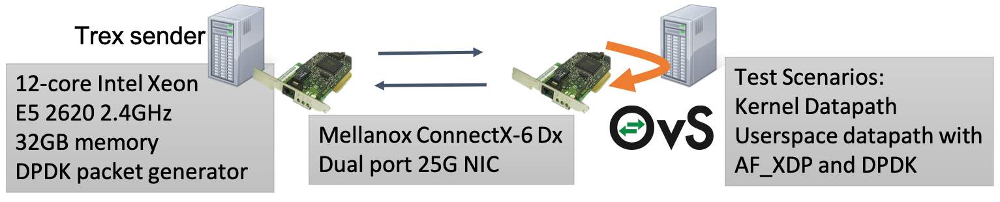

# Revisiting the Open vSwitch Dataplane Ten Years Later

This is the artifacts page for the SIGCOMM2021 paper, Revisiting the Open vSwitch Dataplane Ten Years Later.
We provide
* VMware NSX OpenFlow and OVSDB dataset (Section 5.1 and Table 3).
* Instructions for building OVS with AF_XDP and DPDK, and how to reproduce the performance
  number (Section 5.2 and Figure 8).

## OpenFlow dataset
* [dataset/ovs-ofctl-dump-flows.out.decoded](dataset/ovs-ofctl-dump-flows.out.decoded):
  OpenFlow tables and rules installed at Linux host.
* [dataset/ovs-vsctl-show.out](dataset/ovs-vsctl-show.out):
  Configurations of OVS bridges, tunnels, and interfaces.
* [dataset/nsx-openflow-pipeline.txt](dataset/nsx-openflow-pipeline.txt):
  The text explanation of the OpenFlow pipeline.

## Building Open vSwitch with AF_XDP
All the source code used in the paper has been upstreamed to the public
Open vSwitch [github repo](https://github.com/openvswitch/ovs).
Please follow the official documentation to install
OVS with AF_XDP at [here](https://docs.openvswitch.org/en/latest/intro/install/afxdp/)

If you're familar with Docker, use the [Dockerfile](Dockerfile) to automatically
build and run OVS, by doing
```console
  docker build . 
  docker run --privileged -it <image id> /bin/bash
  root@<image id>:/src/ovs# /start-ovs.sh 
```

## Testbed Configuration
In the paper, we use two machines connected back-to-back (see Section 5.2).
With one Xeon E5 2620 v3 12-core 2.4GHz connected back-to-back through dual-port 25-Gbps Mellanox Connect-X 6Dx NICs. One server ran the TRex traffic generator, the other ran OVS with different datapaths and packet I/O configurations as well as a VM with 2 vCPUs and 4 GB memory. We tested three scenarios, all loopback configurations in which a server receives packets from TRex on one NIC port, forwards them internally across a scenario-specific path, and then sends them back to it on the other.
We measured OVS performance with the in-kernel datapath, with AF_XDP, and with DPDK.


## Measuring Performance with AF_XDP
Once OVS with AF_XDP is successfully built, we provide several scripts to
reproduce the results in the paper. Specifically, for
* Linux kernel datapath
  * [scripts/kernel-p2p.sh](scripts/kernel-p2p.sh):
    a setup for forwarding packets from a physical port to OVS and a physical port.
  * [scripts/kernel-pvp.sh](scripts/kernel-pvp.sh):
    a setup for forwarding packets from a physical port to OVS, to a virtual port for a VM,
    and loopback to the same virtual port, to OVS, and finally a physical port.
  * [scripts/kernel-pcp.sh](scripts/kernel-pcp.sh):
    a setup for forwarding packets from a physical port to OVS, to a container virtual port,
    and loopback to the same container virtual port, to OVS, and finally a physical port.

* OVS Userspace Datapath with DPDK
  * [scripts/dpdk-p2p.sh](scripts/dpdk-p2p.sh): Same as above, but using userspace datapath with DPDK port.
  * [scripts/dpdk-pvp.sh](scripts/dpdk-pvp.sh): Same as above, but using userspace datapath with DPDK port.
  * [scripts/dpdk-pcp.sh](scripts/dpdk-pcp.sh): Same as above, but using userspace datapath with DPDK port.

* OVS Userspace Datapath with AF_XDP
  * [scripts/afxdp-p2p.sh](scripts/afxdp-p2p.sh): Same as above, but using userspace datapath with OVS AF_XDP port.
  * [scripts/afxdp-pvp.sh](scripts/afxdp-pvp.sh): Same as above, but using userspace datapath with OVS AF_XDP port.
  * [scripts/afxdp-pcp.sh](scripts/afxdp-pcp.sh): Same as above, but using userspace datapath with OVS_AF_XDP port.

See section 5.2 and Figure 8 in the paper for details.

