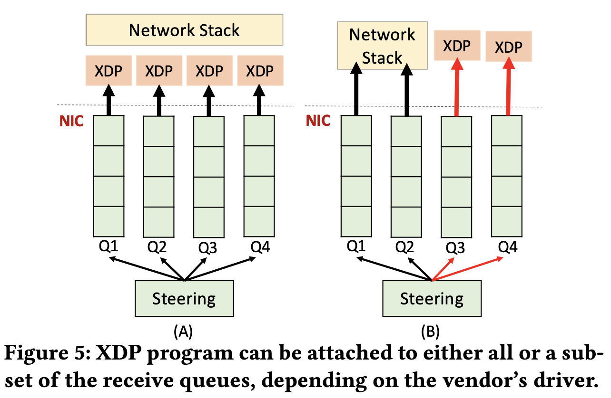

# Uinsg AF_XDP on Mellanox NICs
This page describes how to use AF_XDP on Mellanox Connect-X6.


## Different Design 
Intel, Mellanox, and other vendors have already added Linux driver support for AF_XDP.
Figure 5(A) shows the attachment model currently adopted for Intel NICs, in which all
traffic coming into the device triggers the XDP program. Any program that needs to distinguish
between different types of traffic, e.g. to treat management traffic differently, must implement
logic in the XDP program to parse the protocol and forward the desired traffic to the Linux network stack.

Figure 5(B) shows the attachment model currently adopted for Mellanox NICs, in which an XDP program
can be attached to a subset of a device’s receive queues, e.g. only Q3 and Q4 as shown in the figure.
In this model, users may program the NIC’s hardware’s flow classification rules,
e.g. with ethtool --config-ntuple, to distinguish different type of traffic in hardware,
then write simpler per-queue programs. This model is more flexible, although hardware has
limited matching fields and therefore more complicated case still require software steering logic.

## Settup multi-queues
### On the OVS running server
Here, we want to have qid 0, 1 used for normal traffic, and qid 1, 2 used for XDP traffice.
First, use the ethtool to setup the number of HW queues to 2 (**not 4**).
```shell
ethtool -L enp2s0f0 combined 2
```
Check the result
```shell
ethtool -l enp2s0f0
Channel parameters for enp2s0f0:
Pre-set maximums:
RX:        0
TX:        0
Other:        0
Combined:    12
Current hardware settings:
RX:        0
TX:        0
Other:        0
Combined:    2
```
As a result, the NIC will have first two queues (qid 0, 1) for normal traffic.
Implicitly, it will have another two queues (qid 2, 3) for XDP traffic.
Now we have to setup the hardware flow classification rules to re-direct XDP
traffic to qid 2 and 3.
```
# Assume our traffic from TRex is UDP and 16.0.0.x src-ip
ethtool -U enp2s0f0 flow-type udp4 src-ip 16.0.0.1 dst-port 2001 loc 11 action 2
ethtool -U enp2s0f0 flow-type udp4 src-ip 16.0.0.2 dst-port 2001 loc 22 action 3
```
We then need to patch OVS to use this, because current OVS AF_XDP implementation 
assumes the queue ID always start at qid 0. The patch adds an addition option named
"start-qid", and in our setup, the start-qid should be 2, and n_rxq=2.
So OVS will use AF_XDP's queue id 2 and 3.
```
ovs-vsctl add-port br0 enp2s0f0 -- set int enp2s0f0 type=afxdp \
   options:xdp-mode=native-with-zerocopy \
   options:start-qid=2 options:n_rxq=2
```
OVS AF_XDP QID option patch is below:
https://github.com/williamtu/ovs-travis/commits/afxdp-qid
https://github.com/williamtu/ovs-travis/commit/f36c23f2d4ac8d93efc609b9a6f3ebf065018b37


### On the TRex traffic generator
Here we need to make sure TRex is generating the UDP traffic with th
src-ip/dst-port we programed on the other side of the NIC.
Here we used TRex
[imix_64.yaml](https://github.com/cisco-system-traffic-generator/trex-core/blob/master/scripts/cap2/imix_64.yaml)
as example:
```yaml
#
# Simple IMIX test 64B
#
- duration : 3
  generator :
          distribution : "seq"
          clients_start : "16.0.0.1"
          clients_end   : "16.0.0.2"
... <remains the same>
```
Then start the TRex, ex:
```
./t-rex-64 -f cap2/imix_64.yaml -c 4 -m 3000 
```
Note that once you've setup the flow classification rules at OVS running server,
you will see **no traffic** on your NIC, enp2s0f0, when using Linux tools such as
tcpdump or ip -s link show. This is because Linux kernel only see traffic at qid 0
and qid 1, and the HW flow classification rules redirect traffic to qid 2 and 3.

### Cleanup
When finished, delete the HW classification rules 11 and 22:
```shell
ethtool -U enp2s0f0 delete 11
ethtool -U enp2s0f0 delete 22
```